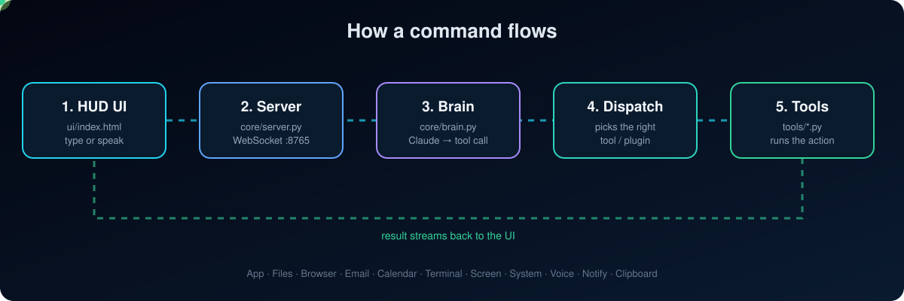

<div align="center">


<a href="https://github.com/harisaltaf151-bit/jarvis-ai-os">
  
</a>

<br/>


</div>

---

## 🤖 What is JARVIS?

A real, local AI OS that controls your computer. It opens apps, writes emails, manages files, browses the web and runs code, all by **voice or text**.

---

## ✨ What It Does

| | Capability | Examples |
|---|---|---|
| 🖥 | **App Control** | "Open VS Code", "Close Spotify", "Set volume to 50%" |
| 📁 | **File Management** | "Find all PDFs modified this week", "Zip my Documents folder" |
| 🌐 | **Browser Automation** | "Search for AI news on Google", "Open YouTube and search lo-fi" |
| ✉️ | **Email** | "Write an email to John about the meeting", "Show my unread emails" |
| 📅 | **Calendar** | "Schedule a team standup tomorrow at 10am", "Remind me in 30 minutes" |
| ⌨️ | **Terminal** | "Run this Python script", "Install numpy", "Ping google.com" |
| 📸 | **Screen Control** | "Take a screenshot", "Click the submit button", "Type this text" |
| 📊 | **System Monitor** | "Show CPU and RAM usage", "What's eating my memory?" |
| 🔔 | **Notifications** | Desktop alerts, scheduled reminders, morning briefings |
| 🎤 | **Voice Control** | Wake word "Hey JARVIS" → speak your command |
| 🔌 | **Plugins** | Drop a `.py` file into `~/.jarvis/plugins/`, auto-loaded |

---

## 🚀 Quick Start (3 steps)

### Step 1: Clone and install

```bash
git clone https://github.com/harisaltaf151-bit/jarvis-ai-os
cd jarvis-ai-os
pip install -r requirements.txt
```

<details>
<summary>Or install dependencies manually</summary>

```bash
pip install websockets aiohttp anthropic psutil selenium webdriver-manager pyautogui pillow icalendar python-dotenv pyttsx3 SpeechRecognition
```

</details>

### Step 2: Configure

```bash
python jarvis.py --setup
```

The setup wizard asks for:
- Your **Anthropic API key** from [console.anthropic.com](https://console.anthropic.com)
- **Email credentials** (optional, for email tools)
- Server ports (defaults: WS=8765, HTTP=8766)

Or copy `.env.example` to `.env` and fill it in manually.

### Step 3: Launch

```bash
python jarvis.py
```

This starts the backend server and opens the UI in your browser automatically.

---

## 🏗 How a command flows



<details>
<summary><b>Project structure (click to expand)</b></summary>

```
jarvis/
├── jarvis.py               ← Master launcher (run this)
├── .env                    ← Your config (API keys, email, ports)
├── requirements.txt
│
├── core/
│   ├── server.py           ← WebSocket + HTTP server (aiohttp + websockets)
│   ├── brain.py            ← Claude AI command interpreter
│   └── plugin_engine.py    ← Plugin loader / registry
│
├── tools/
│   ├── app_controller.py   ← Open/close apps (Windows/macOS/Linux)
│   ├── file_manager.py     ← File CRUD, search, zip, recent
│   ├── browser_agent.py    ← Selenium browser automation
│   ├── email_agent.py      ← IMAP/SMTP email read+send
│   ├── calendar_agent.py   ← Local calendar + .ics export
│   ├── system_monitor.py   ← CPU/RAM/disk/process stats
│   ├── terminal_agent.py   ← Shell + Python executor
│   ├── screen_capture.py   ← Screenshot + mouse/keyboard (PyAutoGUI)
│   ├── voice_module.py     ← STT (Google/Whisper) + TTS (pyttsx3)
│   ├── notification_system.py ← Desktop notifications + reminders
│   └── clipboard_manager.py   ← Clipboard read/write/history
│
├── ui/
│   └── index.html          ← JARVIS HUD (open in any browser)
│
├── scripts/
│   └── automations.py      ← Pre-built automation scripts
│
└── tests/
    └── test_all.py         ← Full test suite
```

</details>

---

## 🎤 Voice Commands

**1. Browser mic** (built into the UI, Chrome/Edge only): click the 🎤 button and speak. Powered by the Web Speech API.

**2. Wake word mode** (Python, works in the background):

```python
from tools.voice_module import VoiceModule
vm = VoiceModule(wake_word="hey jarvis")
vm.start_wake_word_loop(on_command_cb=my_handler)
```

Say **"Hey JARVIS"** and it wakes up and listens. Supports Google STT (online) or **Whisper** (fully offline).

<details>
<summary>Offline voice setup</summary>

```bash
pip install openai-whisper pyaudio
```

Then set `JARVIS_STT_ENGINE=whisper` in `.env`.

</details>

---

## 📚 More Documentation

<details>
<summary><b>✉️ Email setup (Gmail / Outlook)</b></summary>

### Gmail
1. Enable 2-Factor Authentication on your Google account
2. Go to [myaccount.google.com/apppasswords](https://myaccount.google.com/apppasswords)
3. Create an App Password for "Mail"
4. Use that password (not your regular password) in setup

```
EMAIL_ADDRESS="you@gmail.com"
EMAIL_PASSWORD="abcd efgh ijkl mnop"   ← 16-char app password
SMTP_HOST="smtp.gmail.com"
SMTP_PORT="587"
IMAP_HOST="imap.gmail.com"
IMAP_PORT="993"
```

### Outlook / Office 365

```
SMTP_HOST="smtp.office365.com"
SMTP_PORT="587"
IMAP_HOST="outlook.office365.com"
IMAP_PORT="993"
```

</details>

<details>
<summary><b>⚙️ Automation scripts</b></summary>

```bash
# Morning briefing: system health + calendar + inbox
python scripts/automations.py morning

# Preview what cleanup would do (dry run)
python scripts/automations.py cleanup

# Actually clean old files from Downloads
python scripts/automations.py cleanup --apply

# Sort Downloads by file type
python scripts/automations.py organise --apply

# Backup Documents folder to a zip
python scripts/automations.py backup ~/Backups

# Take a screenshot every 5 minutes
python scripts/automations.py screenshot-watch

# AI-powered email digest summary
python scripts/automations.py email-digest

# Full system health report
python scripts/automations.py health
```

**Schedule with cron (macOS/Linux):**

```bash
# Morning briefing every day at 8am
0 8 * * * cd /path/to/jarvis && python scripts/automations.py morning

# Cleanup every Sunday at midnight
0 0 * * 0 cd /path/to/jarvis && python scripts/automations.py cleanup --apply
```

**Schedule with Task Scheduler (Windows):**

```
Action: python C:\jarvis\scripts\automations.py morning
Trigger: Daily at 8:00 AM
```

</details>

<details>
<summary><b>🔌 Writing plugins</b></summary>

Drop a file named `plugin_*.py` into `~/.jarvis/plugins/`:

```python
# ~/.jarvis/plugins/plugin_myapp.py

class MyPlugin:
    name = "myapp"
    description = "Controls my custom app"
    version = "1.0"

    def greet(self, name: str = "world") -> str:
        return f"Hello from JARVIS, {name}!"

    def fetch_data(self, endpoint: str) -> dict:
        import urllib.request, json
        with urllib.request.urlopen(endpoint) as r:
            return json.loads(r.read())
```

JARVIS auto-loads it on startup. Call it via the WebSocket:

```json
{"type": "command", "tool": "myapp", "action": "greet", "params": {"name": "Stark"}}
```

Or install a plugin from a URL:

```python
from core.plugin_engine import PluginEngine
pe = PluginEngine()
pe.install_from_url("https://example.com/plugin_weather.py")
```

</details>

<details>
<summary><b>📡 REST API (localhost:8766)</b></summary>

```bash
# Check health
curl http://localhost:8766/health

# Open Chrome
curl -X POST http://localhost:8766/command \
  -H "Content-Type: application/json" \
  -d '{"tool": "app", "action": "open", "params": {"app": "chrome"}}'

# List recent files
curl -X POST http://localhost:8766/command \
  -d '{"tool": "files", "action": "recent_files", "params": {"days": 3}}'

# Run Python
curl -X POST http://localhost:8766/command \
  -d '{"tool": "terminal", "action": "run_python", "params": {"code": "print(42)"}}'
```

</details>

<details>
<summary><b>🔗 WebSocket API (ws://localhost:8765)</b></summary>

```javascript
const ws = new WebSocket('ws://localhost:8765');

// Execute a tool action
ws.send(JSON.stringify({
  type:   "command",
  id:     "1",
  tool:   "files",
  action: "list_dir",
  params: { path: "~/Documents" }
}));

// Get live system stats
ws.send(JSON.stringify({ type: "system_stats" }));
```

</details>

<details>
<summary><b>🧪 Running tests</b></summary>

```bash
# Run all tests
python tests/test_all.py

# Run specific suite
python tests/test_all.py files
python tests/test_all.py system
python tests/test_all.py terminal
python tests/test_all.py calendar
python tests/test_all.py notify
python tests/test_all.py plugins
```

</details>

<details>
<summary><b>💻 Platform notes</b></summary>

| Feature | Windows | macOS | Linux |
|---|---|---|---|
| App open/close | ✅ | ✅ | ✅ |
| File management | ✅ | ✅ | ✅ |
| Browser (Selenium) | ✅ | ✅ | ✅ |
| Email (IMAP/SMTP) | ✅ | ✅ | ✅ |
| Screenshots | ✅ | ✅ | ✅ (needs display) |
| Mouse/keyboard | ✅ | ✅ | ✅ (needs display) |
| Desktop notifications | ✅ win10toast | ✅ osascript | ✅ notify-send |
| Voice TTS | ✅ SAPI | ✅ NSSpeech | ✅ espeak |
| Voice STT | ✅ | ✅ | ✅ |

**Linux headless:** PyAutoGUI needs a display. For servers use `Xvfb`:

```bash
Xvfb :99 -screen 0 1920x1080x24 &
DISPLAY=:99 python jarvis.py
```

</details>

<details>
<summary><b>🐛 Troubleshooting</b></summary>

**`ANTHROPIC_API_KEY not set`**
Run `python jarvis.py --setup` or create `.env` from `.env.example`.

**`No browser driver found`**
Run `pip install webdriver-manager`. It auto-installs ChromeDriver.

**`pyautogui` / screen tools failing**
- macOS: grant Accessibility + Screen Recording permissions in System Settings
- Windows: run as Administrator if needed

**Voice not working**
- `pip install SpeechRecognition pyaudio pyttsx3`
- macOS: `brew install portaudio` before pyaudio
- Linux: `sudo apt-get install python3-pyaudio portaudio19-dev`

**Email auth errors**
- Gmail: use an **App Password**, not your regular password
- Make sure IMAP is enabled in Gmail settings → See all settings → Forwarding and POP/IMAP

</details>

---

<div align="center">

### 👤 Built by Muhammad Haris

[](https://github.com/harisaltaf151-bit)

*Built with Claude · Python 3.11+ · websockets · aiohttp · Selenium · PyAutoGUI*

MIT License · ⭐ **If you like this project, give it a star!** ⭐

</div>
